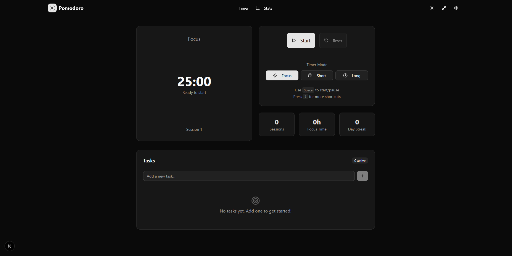
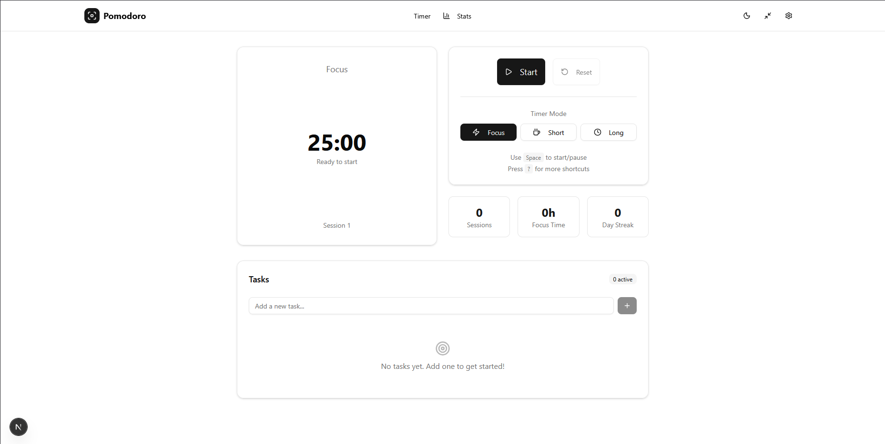
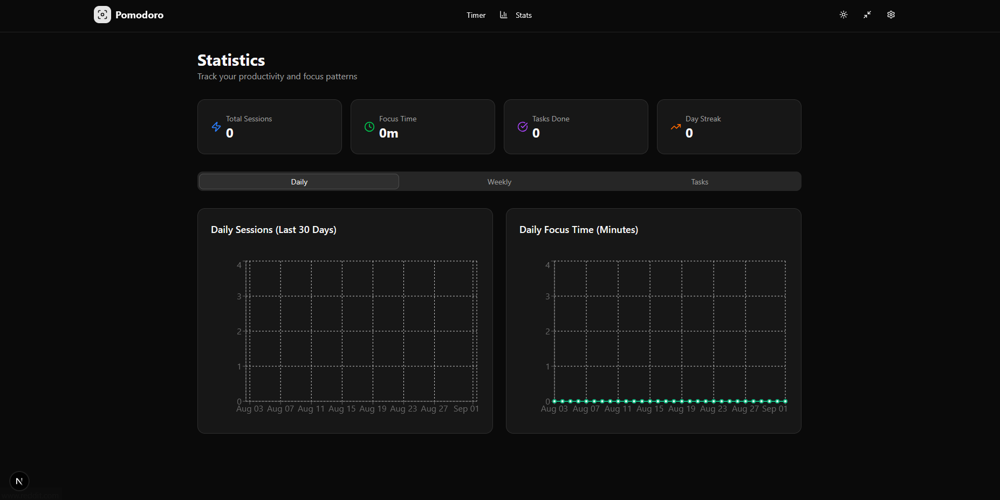

# 🍅 Pomodoro Timer - Stay Focused

A modern, minimal, and highly usable Pomodoro timer web application built with Next.js 14, TypeScript, and Tailwind CSS. Features task management, detailed statistics, PWA support, and full accessibility compliance.

> 🤖 **Built with AI**: This project was developed using GitHub Copilot and AI assistance to demonstrate modern web development practices and create a production-ready application.

[Pomodoro Timer](https://mrctnd.github.io/pomodoro-timer/)


## 📸 Screenshots

### Main Timer Interface






## ✨ Features

### 🔥 Core Functionality

- **Timer Modes**: Pomodoro (25min), Short Break (5min), Long Break (15min) with customizable durations
- **Task Management**: Create, edit, delete, and reorder tasks with drag-and-drop
- **Progress Tracking**: Link tasks to pomodoro sessions and track completion
- **Auto Cycles**: Automatic transitions between focus and break sessions

### 📊 Analytics & Insights

- **Detailed Statistics**: Daily, weekly, and monthly productivity views
- **Interactive Charts**: Visual representation of focus patterns using Recharts
- **Task Analytics**: Most productive tasks, completion rates, and time tracking
- **Streak Tracking**: Monitor consecutive productive days

### 🎨 User Experience

- **Modern Design**: Clean, minimal interface with generous whitespace
- **Dark/Light Theme**: System-aware theme switching with manual override
- **Focus Mode**: Distraction-free fullscreen experience
- **Responsive Design**: Mobile-first approach, works on all devices

### 🔊 Audio & Notifications

- **Smart Notifications**: Desktop notifications with session completion alerts
- **Audio Feedback**: Customizable start/end sounds with volume control
- **Background Accuracy**: Epoch-based timing maintains accuracy across tabs

### ⌨️ Accessibility & Shortcuts

- **WCAG 2.1 AA Compliant**: Full keyboard navigation and screen reader support
- **Keyboard Shortcuts**: Space to start/pause, number keys for modes, and more
- **High Contrast**: Minimum 4.5:1 contrast ratio throughout
- **Focus Indicators**: Clear visual focus rings for keyboard navigation

### 📱 Progressive Web App

- **Offline Support**: Works without internet connection
- **Install Prompt**: Add to home screen on mobile and desktop
- **Service Worker**: Background sync and caching for optimal performance
- **App-like Experience**: Native app feel with proper PWA manifest

### 💾 Data Management

- **Persistent Storage**: IndexedDB with localStorage fallback
- **Data Export/Import**: JSON backup and restore functionality
- **Privacy First**: All data stored locally, no external tracking
- **Cross-Device Sync**: Manual export/import for data portability

## 🚀 Quick Start

### Prerequisites

- Node.js 18+
- pnpm (recommended) or npm

### Installation

```bash
# Clone the repository
git clone https://github.com/your-username/pomodoro-timer.git
cd pomodoro-timer

# Install dependencies
pnpm install

# Start development server
pnpm dev

# Open in browser
# Visit http://localhost:3000
```

### Build for Production

```bash
# Create optimized build
pnpm build

# Start production server
pnpm start

# Or deploy to Vercel, Netlify, etc.
```

## 🏗️ Project Structure

```
src/
├── app/                    # Next.js App Router pages
│   ├── globals.css        # Global styles and CSS variables
│   ├── layout.tsx         # Root layout with providers
│   ├── page.tsx           # Homepage with timer interface
│   ├── settings/          # Settings page
│   └── stats/             # Statistics dashboard
├── components/            # Reusable UI components
│   ├── ui/                # shadcn/ui components
│   ├── Header.tsx         # Navigation header
│   ├── Timer.tsx          # Main timer display
│   ├── TimerControls.tsx  # Start/pause/reset controls
│   ├── TaskList.tsx       # Task management interface
│   └── ThemeProvider.tsx  # Theme context provider
├── hooks/                 # Custom React hooks
│   ├── useAudio.ts        # Audio feedback system
│   ├── useKeyboardShortcuts.ts  # Keyboard navigation
│   └── useNotifications.ts     # Browser notifications
├── lib/                   # Utility functions
│   ├── database.ts        # IndexedDB & localStorage utils
│   └── utils.ts           # Helper functions
├── store/                 # State management
│   └── usePomodoro.ts     # Zustand store
├── types/                 # TypeScript definitions
│   └── index.ts           # Application types
└── test/                  # Test setup and utilities
    └── setup.ts           # Vitest configuration
```

## 🎯 Scripts

| Command         | Description               |
| --------------- | ------------------------- |
| `pnpm dev`      | Start development server  |
| `pnpm build`    | Create production build   |
| `pnpm start`    | Start production server   |
| `pnpm lint`     | Run ESLint                |
| `pnpm lint:fix` | Fix ESLint errors         |
| `pnpm test`     | Run tests with Vitest     |
| `pnpm test:ui`  | Run tests with UI         |
| `pnpm format`   | Format code with Prettier |

## 🧪 Testing

```bash
# Run all tests
pnpm test

# Run tests in watch mode
pnpm test:watch

# Run tests with coverage
pnpm test:coverage

# Run tests with UI
pnpm test:ui
```

## 🔧 Configuration

### Environment Variables

Create a `.env.local` file for local development:

```bash
# Analytics (optional)
NEXT_PUBLIC_GA_ID=your-google-analytics-id

# App Configuration
NEXT_PUBLIC_APP_URL=http://localhost:3000
```

### Customization

- **Timer Durations**: Modify default values in `src/store/usePomodoro.ts`
- **Themes**: Update CSS variables in `src/app/globals.css`
- **Audio**: Replace sound files in `src/hooks/useAudio.ts`
- **PWA**: Configure manifest in `public/manifest.webmanifest`

## 📦 Tech Stack

### Core Framework

- **Next.js 14**: React framework with App Router
- **TypeScript**: Type-safe JavaScript
- **Tailwind CSS**: Utility-first CSS framework

### UI & Design

- **shadcn/ui**: High-quality component library
- **Radix UI**: Unstyled, accessible UI primitives
- **Framer Motion**: Smooth animations and transitions
- **Lucide React**: Beautiful, customizable icons

### State & Data

- **Zustand**: Lightweight state management
- **Dexie**: IndexedDB wrapper for local storage
- **date-fns**: Modern date utility library

### Charts & Visualization

- **Recharts**: Composable charting library
- **Custom Visualizations**: Progress rings and indicators

### Development Tools

- **ESLint**: Code linting and formatting
- **Prettier**: Code formatting
- **Husky**: Git hooks for code quality
- **Vitest**: Fast unit testing framework
- **Testing Library**: React component testing

## ♿ Accessibility

This application is built with accessibility as a first-class citizen:

- **Keyboard Navigation**: Full app functionality via keyboard
- **Screen Reader Support**: Comprehensive ARIA labels and descriptions
- **High Contrast**: 4.5:1 minimum contrast ratio
- **Focus Management**: Clear focus indicators and logical tab order
- **Reduced Motion**: Respects user's motion preferences
- **Semantic HTML**: Proper heading hierarchy and landmarks

## 🌍 Browser Support

- **Chrome/Edge**: 88+
- **Firefox**: 85+
- **Safari**: 14+
- **Mobile Safari**: 14+
- **Chrome Android**: 88+

## 📄 License

This project is licensed under the MIT License - see the [LICENSE](LICENSE) file for details.

## 🤝 Contributing

Contributions are welcome! Please feel free to submit a Pull Request. For major changes, please open an issue first to discuss what you would like to change.

1. Fork the project
2. Create your feature branch (`git checkout -b feature/AmazingFeature`)
3. Commit your changes (`git commit -m 'Add some AmazingFeature'`)
4. Push to the branch (`git push origin feature/AmazingFeature`)
5. Open a Pull Request

## 🙏 Acknowledgments

- [Pomodoro Technique](https://francescocirillo.com/pages/pomodoro-technique) by Francesco Cirillo
- [shadcn/ui](https://ui.shadcn.com/) for the beautiful component library
- [Radix UI](https://www.radix-ui.com/) for accessible primitives
- [Vercel](https://vercel.com/) for hosting and deployment platform

## 📞 Support

If you have any questions or need help, please:

1. Check the [documentation](docs/)
2. Search [existing issues](https://github.com/your-username/pomodoro-timer/issues)
3. Create a [new issue](https://github.com/your-username/pomodoro-timer/issues/new)

---

**Built with ❤️ and ☕ for productivity enthusiasts worldwide.**
